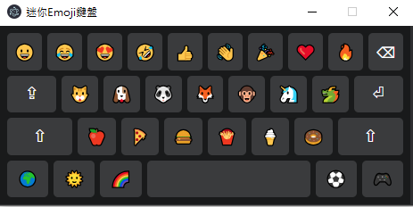

# 🎮 Emoji 鍵盤 (Electron 版)

 <!-- 記得放一張截圖 -->

一個用 Electron 開發的可自訂 Emoji 鍵盤工具，點擊即可複製 Emoji 到剪貼簿。

## ✨ 功能特色

- 一鍵複製 Emoji
- 仿機鍵盤 UI 設計
- 視窗大小鎖定不跑版

## 未來延伸

- 支援自訂快捷鍵 (可修改程式碼擴充)

## 🚀 快速開始

### 基本需求

- Node.js 16+
- npm 8+

### 安裝步驟

```bash
# 1. 克隆倉庫
git clone https://github.com/Jeffrey0117/Electron-keyboard.git

# 2. 進入專案目錄
cd Electron-keyboard

# 3. 安裝依賴
npm install

# 4. 啟動應用
npm start
```

## 🛠️ 專案結構

```
Electron-keyboard/
├── main.js          # 主進程
├── preload.js       # 預載腳本
├── index.html       # 鍵盤 UI
├── package.json
└── README.md
```

## 💡 進階設定

### 自訂按鍵

修改 `index.html` 中的按鍵陣列：

```javascript
// 預設 Emoji 陣列
const emojis = ["😀", "😂", "❤️", "👍", "👋"];
```

### 打包成執行檔

```bash
npm run dist
```
